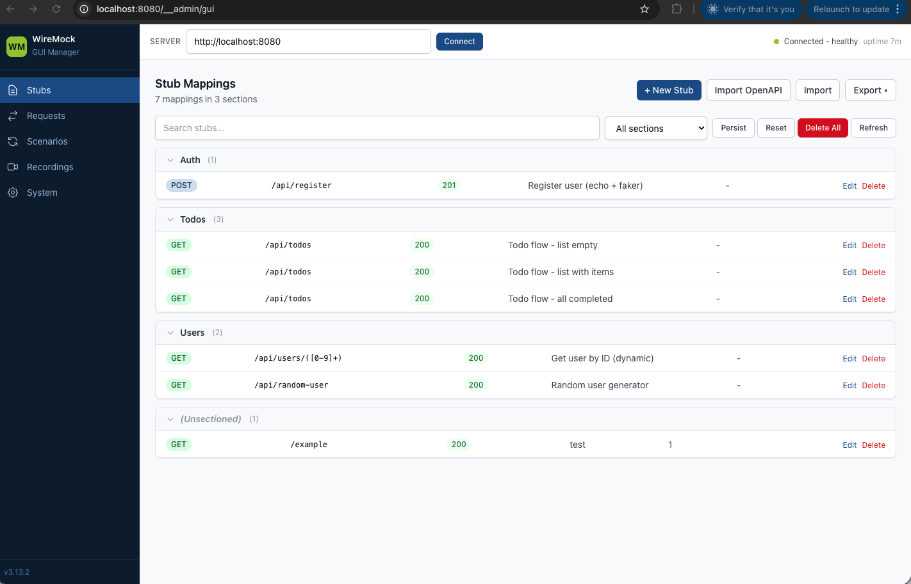

# WireMock GUI

A web-based GUI for managing WireMock stub mappings, request journals, scenarios, and recordings. Works as a WireMock extension served directly from the WireMock admin API.



## Features

- **Stub Mappings** - Full CRUD with form editor and JSON editor, import/export, search/filter, persist/reset
- **Request Journal** - Browse all logged requests, view details, filter unmatched, clear journal
- **Scenarios** - View scenario states and reset all scenarios
- **Recordings** - Start/stop recording with target URL, take snapshots
- **System** - Health monitoring, global settings, body file management, server reset/shutdown
- **Multi-server** - Connect to any WireMock instance (local, remote, container) via configurable URL

## Quick Start

### Build

```bash
mvn clean package
```

This builds the React frontend and packages everything into a single JAR at `target/wiremock-gui-1.0.0.jar`.

### Download WireMock Standalone

You need the WireMock standalone JAR (fat JAR with all dependencies):

```bash
curl -L -o wiremock-standalone.jar \
  https://repo1.maven.org/maven2/org/wiremock/wiremock-standalone/3.13.2/wiremock-standalone-3.13.2.jar
```

### Run with WireMock

**Option 1: Classpath extension (recommended)**

```bash
java -cp "target/wiremock-gui-1.0.0.jar:wiremock-standalone.jar" \
  wiremock.Run --extensions com.wiremock.gui.WireMockGuiExtension
```

**Option 2: Docker**

```bash
docker run -it --rm \
  -p 8080:8080 \
  -v ./target/wiremock-gui-1.0.0.jar:/var/wiremock/extensions/wiremock-gui-1.0.0.jar \
  wiremock/wiremock:3.13.2-2 \
  --extensions com.wiremock.gui.WireMockGuiExtension
```

**Option 3: Try with example stubs**

This repo includes an `example/` folder with sample mappings. After building, run:

```bash
docker run -it --rm \
  -p 8080:8080 \
  -v $PWD/example:/home/wiremock \
  -v $PWD/target/wiremock-gui-1.0.0.jar:/var/wiremock/extensions/wiremock-gui-1.0.0.jar \
  wiremock/wiremock:3.13.2-2 \
  --extensions com.wiremock.gui.WireMockGuiExtension
```

### Access the GUI

Open your browser at:

```
http://localhost:8080/__admin/gui
```

### Standalone Frontend Development

For frontend development without the Java extension:

```bash
cd webapp
npm install
npm run dev
```

This starts a Vite dev server at `http://localhost:3000` with a proxy to `http://localhost:8080` for the WireMock API. Make sure a WireMock instance is running on port 8080.

## Workflow: Version-Controlled Stubs

Keep your WireMock mappings (and optionally response body files and extension JARs) in a git repository, and run them locally or on a remote machine.

### Repository layout

```
my-wiremock-stubs/
├── mappings/                        # Stub mapping JSON files
├── __files/                         # Response body files (optional)
└── extensions/
    └── wiremock-gui-1.0.0.jar       # This extension (and any others)
```

Initialize it:

```bash
mkdir -p my-wiremock-stubs/{mappings,__files,extensions}
cp target/wiremock-gui-1.0.0.jar my-wiremock-stubs/extensions/
cd my-wiremock-stubs && git init
```

### Running locally

WireMock reads `mappings/` and `__files/` from its root directory (`/home/wiremock` inside the container). Mount the repo root there so existing stubs are loaded on startup. Extensions are loaded from `/var/wiremock/extensions`.

```bash
cd my-wiremock-stubs
docker run -it --rm \
  -p 8080:8080 \
  -v $PWD:/home/wiremock \
  -v $PWD/extensions:/var/wiremock/extensions \
  wiremock/wiremock:3.13.2-2 \
  --extensions com.wiremock.gui.WireMockGuiExtension
```

Open `http://localhost:8080/__admin/gui`, create or edit stubs, then click **Persist** to write them to the mounted `mappings/` directory on your host.

### Running on a remote machine

Same setup on the remote host:

```bash
git clone <your-repo-url> && cd my-wiremock-stubs
docker run -d --restart unless-stopped \
  -p 8080:8080 \
  -v $PWD:/home/wiremock \
  -v $PWD/extensions:/var/wiremock/extensions \
  wiremock/wiremock:3.13.2-2 \
  --extensions com.wiremock.gui.WireMockGuiExtension
```

You can manage stubs in two ways:

- **Remote GUI** - open `http://<remote-host>:8080/__admin/gui` directly
- **Local GUI, remote server** - open the GUI on any WireMock instance and use the connection bar at the top to point it at `http://<remote-host>:8080`

### Committing changes

After editing stubs through the GUI, click **Persist** to flush in-memory mappings to disk, then commit:

```bash
git add mappings/ __files/
git commit -m "Update stubs"
git push
```

On the remote machine, pull and reload without restarting:

```bash
git pull
curl -X POST http://localhost:8080/__admin/mappings/reset
```

### Adding custom response transformers (optional)

Add extra extension JARs to `extensions/` -- they are all loaded automatically:

```bash
my-wiremock-stubs/
└── extensions/
    ├── wiremock-gui-1.0.0.jar
    └── my-custom-transformer.jar
```

```bash
docker run -it --rm \
  -p 8080:8080 \
  -v $PWD:/home/wiremock \
  -v $PWD/extensions:/var/wiremock/extensions \
  wiremock/wiremock:3.13.2-2 \
  --extensions com.wiremock.gui.WireMockGuiExtension,com.example.MyTransformer
```

## Project Structure

```
wiremock-gui/
├── pom.xml                          # Maven build (Java + frontend)
├── src/main/java/com/wiremock/gui/
│   ├── WireMockGuiExtension.java    # AdminApiExtension - registers routes
│   ├── GuiPageTask.java             # Serves index.html at /__admin/gui
│   └── GuiStaticAssetTask.java      # Serves JS/CSS at /__admin/gui/assets/*
├── webapp/                          # React frontend
│   ├── package.json
│   ├── vite.config.ts
│   ├── index.html
│   └── src/
│       ├── App.tsx                  # Main app with connection management
│       ├── api/wiremock-client.ts   # WireMock REST API client
│       ├── components/
│       │   ├── Layout.tsx           # Sidebar + connection bar
│       │   ├── StubMappings.tsx     # Stub list, search, bulk actions
│       │   ├── StubEditor.tsx       # Form + JSON editor for stubs
│       │   ├── RequestJournal.tsx   # Request log viewer
│       │   ├── Scenarios.tsx        # Scenario state viewer
│       │   ├── Recordings.tsx       # Record/playback controls
│       │   └── SystemInfo.tsx       # Health, settings, files, actions
│       └── types/wiremock.ts        # TypeScript types for WireMock API
```

## Tech Stack

- **Backend**: Java 11+, WireMock 3.x AdminApiExtension
- **Frontend**: React 18, TypeScript, Vite, Tailwind CSS
- **Build**: Maven with frontend-maven-plugin

## WireMock API Coverage

| Feature | Endpoints |
|---------|-----------|
| Stub Mappings | GET/POST/DELETE `/__admin/mappings`, GET/PUT/DELETE `/__admin/mappings/{id}`, POST `reset`/`save`/`import` |
| Requests | GET/DELETE `/__admin/requests`, GET `unmatched`, DELETE `/__admin/requests/{id}` |
| Scenarios | GET `/__admin/scenarios`, POST `reset` |
| Recordings | GET `status`, POST `start`/`stop`/`snapshot` |
| Files | GET `/__admin/files`, GET/PUT/DELETE `/__admin/files/{id}` |
| System | GET `health`/`version`, POST `settings`/`reset`/`shutdown` |
